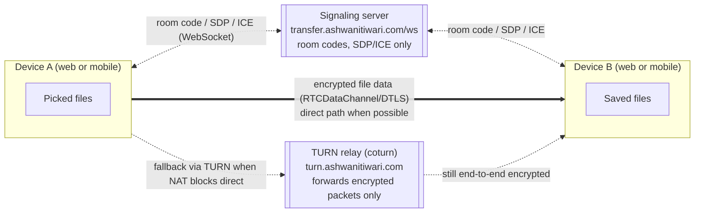
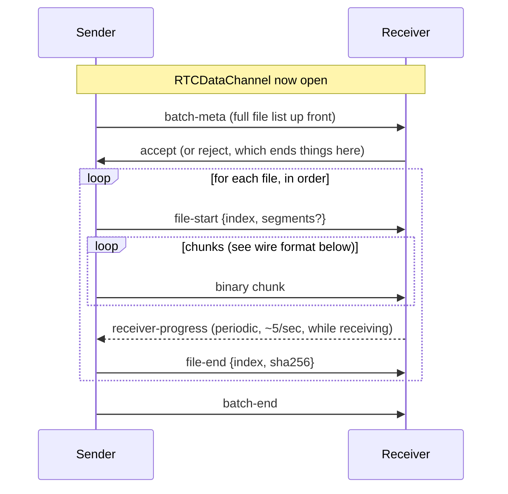

# PeerBridge Mobile — porting spec for a React Native client

This document is a complete, self-contained spec for building a React
Native app that **interoperates with the live PeerBridge web app**
(`transfer.ashwanitiwari.com`) — a mobile user and a web user must be
able to send files to each other through the same room code, over the
same signaling server, using the same wire protocol. It is written to
be handed to an AI coding assistant with or without access to this
repository; where it references a source file, that's for a human or
an agent with repo access to verify exact behavior, not a dependency
for understanding the spec itself.

**If you do have repo access**, the reference implementation is
[lib/webrtc.ts](lib/webrtc.ts) (the entire protocol, sender and
receiver, in one file), [lib/signaling-client.ts](lib/signaling-client.ts)
(the signaling WebSocket client), and [server/signaling.js](server/signaling.js)
(the signaling server itself — read-only reference, you will not be
modifying or redeploying this). Treat those three files as the ground
truth if anything below is ambiguous.

---

## 1. What this app does and doesn't do

- **Does**: let two devices exchange files directly over WebRTC, paired
  by a 6-character room code (or a QR code encoding a join link).
  Nothing is ever uploaded to a server, cloud storage, or database.
- **Doesn't**: have accounts, history, or any server-side record of a
  transfer. Once both sides close the app/tab, there's nothing to
  resume — this is deliberate (see [Security & Privacy](#5-security--privacy-properties-to-preserve)).

The three non-negotiable properties, unchanged on mobile:

1. **End-to-end encrypted** — WebRTC's `RTCDataChannel` is encrypted
   with DTLS as a mandatory part of the standard; there is no way to
   disable this, on web or in `react-native-webrtc`.
2. **Peer-to-peer** — file bytes travel device-to-device (or through a
   TURN relay as a blind packet forwarder when a direct path is
   blocked — the relay never decrypts anything).
3. **Zero server-side storage** — the signaling server only ever sees
   room codes and connection metadata (SDP/ICE), never file contents.

---

## 2. Architecture



Both the web app and a mobile client talk to the **same** signaling
server and the **same** TURN relay — there is nothing web-specific
about either. A mobile app implementing the protocol below can pair
with a web browser's tab using the exact same room code flow.

---

## 3. Signaling protocol (WebSocket)

**Endpoint**: `wss://transfer.ashwanitiwari.com/ws`

Connect a plain WebSocket. Every message, both directions, is JSON
with a `type` field. The server (`server/signaling.js`) is intentionally
tiny — it only relays messages between the two peers in a room and
does simple bookkeeping; it never inspects file data.

### Client → server messages

| `type` | Fields | When |
|---|---|---|
| `create-room` | `roomId: string` | Sender: create/claim a room with this code |
| `join-room` | `roomId: string` | Receiver: join an existing room |
| `signal` | `roomId, targetId, data` | Relay an SDP offer/answer or ICE candidate to the other peer (see [§4](#4-data-channel-wire-protocol) for `data` shape) |
| `cancel` | `roomId: string` | Either side: intentionally abort — the other side gets a `cancelled` event, distinct from a plain disconnect |
| `leave-room` | *(none)* | Clean disconnect |
| `ping` | `ts: number` | App-level keepalive; server replies `pong` with the same `ts`, useful for measuring round-trip latency |

### Server → client messages

| `type` | Fields | Meaning |
|---|---|---|
| `room-created` | `roomId, peerId` | Your `create-room` succeeded — you are now the sender |
| `room-joined` | `roomId, peerId, senderId` | Your `join-room` succeeded — you are now the receiver, `senderId` is who to signal |
| `peer-joined` | `peerId, role` | Sender side: a receiver joined (or re-announced after a signaling reconnect) |
| `peer-left` | `peerId, role` | The other side disconnected |
| `cancelled` | `by: "sender" \| "receiver"` | The other side intentionally cancelled |
| `signal` | `peerId, data` | Relayed SDP/ICE from the other peer |
| `pong` | `ts` | Reply to your `ping` |
| `error` | `message` | e.g. `"Room not found"` when joining a nonexistent/expired code |

### Room codes

6 characters, uppercase, from the alphabet
`ABCDEFGHJKLMNPQRSTUVWXYZ23456789` (excludes `0`/`O` and `1`/`I` to
avoid manual-entry ambiguity — see [lib/room-code.ts](lib/room-code.ts)).
Generate client-side with any equivalent RNG; there's no
server-side uniqueness enforcement beyond "first sender to claim a
code wins it."

### Reconnect behavior to replicate

Mobile networks drop and resume connections far more than desktop
WiFi. The reference client (`SignalingClient` in
[lib/signaling-client.ts](lib/signaling-client.ts)) auto-reconnects on
an unexpected close with exponential backoff (1s → 2s → 4s → 8s cap),
and re-runs `create-room`/`join-room` automatically on every
reconnect's `open` event. The server's `create-room` handler
specifically supports this: a **stale** sender socket (already closed)
loses its claim to a new `create-room` for the same code, and any
receivers already waiting in that room get re-announced as fresh
`peer-joined` events to the newly-reconnected sender — so a signaling
blip mid-transfer self-heals without the user seeing anything beyond
a brief "Reconnecting…" state. Replicate this reconnect + re-announce
handling; don't skip it — it's what makes the web app tolerate the
kind of connectivity blips mobile networks produce constantly.

---

## 4. Data channel wire protocol

Once signaling completes (SDP offer/answer + ICE candidates exchanged
via `signal` messages above) and the DTLS handshake finishes, an
`RTCDataChannel` opens — from this point everything is peer-to-peer,
the signaling server is no longer involved except for `cancel`/`leave`.

**One data channel role model**: the sender always initiates
(`pc.createDataChannel("file-transfer", { ordered: true })`); the
receiver gets it via `ondatachannel`. Same channel carries both JSON
control messages (as UTF-8 text frames) and binary file chunks
(ArrayBuffer frames) — distinguish by frame type, not a wrapper.

### Control messages (JSON, sent as WebSocket/DataChannel text frames)

```ts
type DataChannelMessage =
  | { type: "batch-meta"; files: FileMeta[] }
  | { type: "accept" }
  | { type: "reject" }
  | { type: "file-start"; index: number; segments?: FileSegment[] }
  | { type: "file-end"; index: number; sha256: string }
  | { type: "batch-end" }
  | { type: "receiver-progress"; index: number; bytesTransferred: number; totalBytes: number; segments?: SegmentProgress[] };

interface FileMeta {
  name: string;
  relativePath: string; // equals `name` for a flat file; folder path for a folder drop
  size: number;
  mime: string;
}

interface FileSegment {
  connId: number; // 0 = primary connection; see §6
  start: number;  // byte offset, inclusive
  end: number;    // byte offset, exclusive
}

interface SegmentProgress {
  connId: number;
  bytesTransferred: number;
  totalBytes: number;
}
```

### Sequence



Note `receiver-progress` flows the opposite direction from everything
else — the receiver reports its own confirmed write progress back to
the sender periodically (throttled to ~every 200ms), so the sender can
show "received by peer" distinct from its own "bytes handed to the
channel" view. Not required for correctness, only for UI — safe to
omit in a first pass and add later.

### Binary chunk wire format

**Every binary frame is a 9-byte header followed by raw payload
bytes** — this is true whether a file uses one connection or several
(see §6):

```
byte 0:      connId (uint8) — which connection sent this chunk (cosmetic, UI only)
bytes 1-8:   absolute byte position within the file (float64, big-endian)
bytes 9+:    raw chunk payload (up to 64KB)
```

This makes each chunk **self-describing** — the receiver writes it to
`position` regardless of what order chunks arrive in, or which
connection carried it. This matters a lot on mobile: a connection can
drop mid-transfer, and as long as the receiver is writing by absolute
position rather than assuming strict append-order, a resumed/rerouted
send doesn't corrupt anything.

Pseudocode (language-agnostic — implement equivalently, e.g. with a
`DataView` in JS/RN, or manual byte packing in Swift/Kotlin if you go
fully native):

```
encodeChunk(connId, position, payload):
  header = 9 bytes
  header[0] = connId
  header[1..8] = float64_big_endian(position)
  return concat(header, payload)

decodeChunk(buffer):
  connId = buffer[0]
  position = float64_big_endian(buffer[1..8])
  payload = buffer[9:]
  return { connId, position, payload }
```

**Chunk size**: 64KB (`CHUNK_SIZE = 64 * 1024`). Read via whatever your
platform's file-slicing API is (`Blob.slice()` equivalent) — don't load
the whole file into memory at once for large files.

**Backpressure**: after each `send()`, check the channel's buffered
amount; if it exceeds 8MB, pause and wait for it to drain (react-native-webrtc
exposes `bufferedAmount` and a `bufferedamountlow` event just like the
web API — mirror the reference's `waitForBufferedAmountLow` pattern:
set `bufferedAmountLowThreshold = 1MB`, then `await` the
`bufferedamountlow` event before sending more).

### Completion condition (important — don't assume ordering)

**Do not treat `file-end` arriving as proof that every chunk for that
file has arrived.** Once a file can be split across multiple
connections (§6), there's no cross-connection ordering guarantee — a
worker connection's last chunk can legitimately arrive *after*
`file-end`, which travels on the primary connection. The correct
completion condition, matching the reference implementation:

> A file is done once **both** are true: (a) total bytes received for
> that file equals its known size (tracked by summing payload lengths
> as chunks arrive, regardless of order/connection), and (b) the
> `file-end` message has arrived (giving you the expected SHA-256).
> Whichever of the two happens second is what triggers verification —
> guard with a `finished` flag so it only fires once.

### Integrity verification

Sender computes SHA-256 of the whole file (independently of the
chunking — read the whole file and hash it, in parallel with sending
chunks) and sends it in `file-end`. Receiver, once all bytes are in,
hashes what it wrote and compares. On mismatch, surface an error to
the user — don't silently accept a corrupted file. React Native has no
built-in Web Crypto; use a library like `react-native-quick-crypto` or
`expo-crypto` for SHA-256.

---

## 5. Security & privacy properties to preserve

1. **DTLS is mandatory and automatic** — `react-native-webrtc`'s
   `RTCPeerConnection`/`RTCDataChannel` enforce this exactly like the
   browser APIs; there's no configuration that disables it. Nothing
   extra to implement here beyond using the library correctly.
2. **The signaling server never sees file data** — don't add any
   "upload progress to server" telemetry or crash-reporting that
   accidentally captures file content/names in a way that leaves the
   device. File *names* are already visible to the signaling-adjacent
   flow only in the sense that they're in `batch-meta`, which travels
   peer-to-peer, not through the signaling server.
3. **TURN is a blind relay** — if you self-host or reuse the existing
   coturn relay, never build anything that terminates DTLS at the
   relay (that would break end-to-end encryption). Standard TURN
   usage (relay UDP/TCP packets, don't decrypt) is what's already
   deployed; just point your `iceServers` config at it (§7).
4. **SHA-256 verification is an integrity check, not a substitute for
   encryption** — keep both.

---

## 6. Parallel connections ("download in parts")

For files ≥ 4MB, the reference sender negotiates up to 3 *additional*
`RTCPeerConnection`s with the same peer (4 total: connId 0 = primary,
1-3 = workers) and splits the file into that many contiguous byte
ranges, sent concurrently, one per connection. Each extra connection
is a **fully independent transport with its own congestion window** —
critically different from opening multiple `RTCDataChannel`s on *one*
`RTCPeerConnection`, which share a single SCTP association and one
congestion window, giving zero throughput benefit. This is optional to
implement in a first pass — the single-connection path is simpler and
fully interoperable on its own (a mobile client without this feature
can still send/receive from a web client that has it: the receiver
side already has to handle the general case of an arbitrary number of
segments, including exactly one).

If you do implement it:

- Negotiate extra connections by tagging `signal` messages' `data`
  payload with a `connId` field (0 for primary, 1+ for workers) — the
  signaling server relays `data` opaquely, so this needs zero
  server-side changes, just client-side tagging.
- `file-start`'s optional `segments` array tells the receiver the byte
  ranges to expect; each segment's chunks arrive tagged with their
  `connId` in the 9-byte chunk header (§4) — but since chunks are
  position-addressed, not connection-addressed, a struggling/dropped
  worker connection's remaining bytes can safely be resent over the
  primary connection without any special-casing on the receive side.
- Give a worker connection a short timeout (~5s) to open before giving
  up on it for that transfer — don't block the whole transfer waiting
  on a slow ICE negotiation for an optional optimization.

Real-world expectation to set correctly if you build UI copy around
this: it most likely helps on long-distance/high-latency paths
(especially anything relayed through TURN across countries), and does
**not** reliably speed up a transfer between two devices already
fully utilizing a fast direct link — two peers are usually bottlenecked
by one side's raw bandwidth, which parallel connections between the
same two endpoints can't exceed. Don't market this as a guaranteed
speed multiplier.

---

## 7. ICE / TURN configuration

```js
const ICE_SERVERS = [
  { urls: "stun:stun.l.google.com:19302" },
  { urls: "stun:stun1.l.google.com:19302" },
  {
    urls: [
      "turn:turn.ashwanitiwari.com:3478",
      "turns:turn.ashwanitiwari.com:5349?transport=tcp",
    ],
    username: "<ask for current credential>",
    credential: "<ask for current credential>",
  },
];
```

Pass this as `iceServers` to `RTCPeerConnection`. STUN alone cannot
traverse symmetric/carrier-grade NAT — extremely common on mobile
data specifically, which is presumably most of this app's real mobile
usage — so the TURN entry above is not optional for a mobile client
to work reliably across different networks/carriers. Get the current
TURN username/credential from the project owner rather than guessing;
they're not meant to be public/committed (unlike the STUN URLs, which
are just Google's public servers).

---

## 8. File system — mobile equivalents of the web APIs

The web client uses the **File System Access API**
(`showSaveFilePicker`/`showDirectoryPicker`) to stream received bytes
straight to a user-picked disk location, falling back to buffering in
memory when that API isn't available (Safari/Firefox). On React
Native there's no equivalent browser API — use:

- **`react-native-fs`** or **`expo-file-system`** for writing chunks to
  a file at a given byte offset as they arrive (look for a
  position/offset-aware write, or open a file handle and seek — if the
  library only supports append, you'll need to either buffer
  out-of-order chunks until they're contiguous, or fall back to the
  single-connection path only, where strict in-order arrival makes
  simple sequential writes safe).
- **Picking a save location**: use the platform's native share/save
  sheet, or a library like `react-native-document-picker` /
  `expo-document-picker` for the "save to a chosen folder" flow. iOS
  and Android have meaningfully different UX conventions here (iOS:
  Files app / share sheet; Android: Storage Access Framework) — don't
  try to force a single unified picker UI, use each platform's native
  pattern.
- **Picking files/folders to send**: `expo-document-picker` (files) and
  note that "pick a whole folder to send" is not a first-class concept
  on mobile the way drag-and-drop-a-folder is on desktop — consider
  whether that's in scope for v1 or whether "pick multiple files" is
  enough.

---

## 9. Other things to replicate from the reference behavior

- **Cancel is explicit and bidirectional** — either side can cancel at
  any point (before or during a transfer); it goes over signaling
  (`cancel` message), not the data channel, so it still works even
  before the data channel opens. The other side gets a `cancelled`
  event and should show a clear "the other side cancelled" state, not
  a generic error.
- **A stall should surface an error, not hang silently** — the
  reference implementation arms a watchdog timer (15s) that's re-armed
  on every chunk actually sent/received; if it ever fires while status
  is still "transferring," that's a clear signal something's silently
  broken (e.g. a firewall blocking the data channel after signaling
  succeeded) and the user should see an explicit error rather than an
  indefinitely spinning progress indicator. Same principle applies to
  the initial connection phase: give up with a clear diagnosis (no
  candidates found / no relay found / relay found but still failed)
  after ~30s rather than hanging forever if ICE never completes.
- **App backgrounding**: on mobile this matters even more than on a
  desktop browser tab. iOS in particular suspends background network
  activity aggressively. Decide deliberately whether a transfer should
  attempt to continue in the background (likely requires a background
  task/service on both platforms, with real OS-imposed time limits —
  don't assume it's possible to guarantee) or whether the UX should
  clearly warn the user to keep the app foregrounded during a
  transfer. This is a product decision the web app sidesteps (browser
  tabs have their own, different backgrounding behavior) — make it
  explicitly for mobile rather than discovering the limitation via bug
  reports.

---

## 10. Suggested React Native stack

- **`react-native-webrtc`** — the community-maintained WebRTC bindings;
  this is the only realistic choice, there's no first-party RN WebRTC
  API. Its `RTCPeerConnection`/`RTCDataChannel` surface closely mirrors
  the web APIs used throughout this spec.
- **A plain WebSocket** (React Native's built-in `WebSocket` global) for
  the signaling client — no library needed, it's a thin JSON protocol
  (§3).
- **`expo-file-system`** or **`react-native-fs`** for disk I/O (§8).
- **`react-native-quick-crypto`** or **`expo-crypto`** for SHA-256 (§4).
- **`react-native-qrcode-svg`** (or equivalent) for rendering the room
  code as a scannable QR — encode the same join-link shape the web app
  uses: `https://transfer.ashwanitiwari.com/join/<ROOMCODE>`. A mobile
  app scanning that QR should deep-link straight into join flow with
  the code pre-filled.
- **Camera-based QR scanning** (e.g. `react-native-vision-camera` +
  a barcode-scanning plugin) if you want mobile-to-mobile pairing via
  camera scan rather than typing the code.

---

## Quick reference: what's shared vs. what's platform-specific

| Layer | Shared across web & mobile | Platform-specific |
|---|---|---|
| Signaling protocol (§3) | Fully shared, same server | — |
| Data channel wire protocol (§4) | Fully shared | — |
| ICE/TURN config (§7) | Fully shared | — |
| WebRTC engine | Same underlying browser engine on web; `react-native-webrtc` wraps the equivalent native engines on mobile | API surface nearly identical, but verify event names/timing against `react-native-webrtc`'s docs, don't assume 1:1 |
| File save/pick UX | Same *concept* (pick a destination, stream to it) | Implementation is fully platform-specific (§8) |
| SHA-256 | Same algorithm, same output | Different library per platform |
