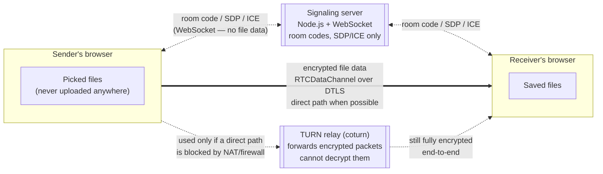
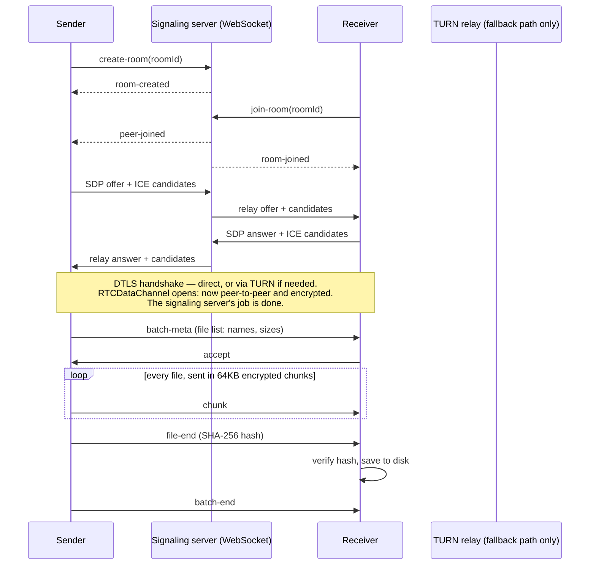

# PeerBridge

Zero-cloud, ephemeral peer-to-peer file transfer. Files never touch a
server — they stream directly between two browsers over an
**end-to-end encrypted, peer-to-peer** WebRTC `RTCDataChannel`. The
server only ever relays a room code and connection-setup metadata
(SDP/ICE) — never file contents.

Live at **[transfer.ashwanitiwari.com](https://transfer.ashwanitiwari.com)**, a free tool from [ashwanitiwari.com](https://ashwanitiwari.com). Questions or feedback: [ashwanitiwari.com/contact](https://ashwanitiwari.com/contact) or dev.ashwanitiwari@gmail.com.

---

## Architecture

Two roles — a **signaling server** (bookkeeping only) and a **TURN
relay** (fallback only) — neither of which ever sees a file:



**Both the signaling server and the TURN relay run on the same
always-on VPS** ([DEPLOY.md](DEPLOY.md)) — but architecturally they're
just infrastructure that helps two browsers *find* each other and
*punch through NAT*. Once the `RTCDataChannel` is open, file data flows
directly between the two browsers (or through the TURN relay as a
blind packet forwarder when a direct path isn't possible) — it is
never written to disk, a database, or any server-side storage,
anywhere, at any point.

### Connection sequence



---

## Security & privacy

Two properties, both structural — not configuration options that could
be silently disabled, and both true whether a transfer goes direct or
through the TURN relay:

1. **End-to-end encrypted.** `RTCDataChannel` traffic is encrypted with
   DTLS as a mandatory part of the WebRTC standard — every browser
   enforces this; there is no unencrypted mode. The two browsers
   negotiate their own encryption keys directly with each other over
   the signaling channel (via DTLS fingerprints in the SDP exchange);
   no server, including this project's own signaling server or TURN
   relay, ever holds those keys.
2. **Peer-to-peer.** File bytes travel `RTCDataChannel`-to-
   `RTCDataChannel`, browser to browser. The signaling server only
   relays room codes and connection setup (SDP/ICE) — it never
   receives file data, encrypted or otherwise. The TURN relay is a
   fallback used only when a direct path is blocked by NAT/firewalls
   (common across different countries/networks); even then, it's
   relaying already-encrypted packets it has no ability to decrypt —
   still end-to-end between the two browsers, not server-to-browser.

Additionally: each file's SHA-256 hash is computed independently on
both ends and compared after transfer, so the receiver can verify the
file arrived byte-for-byte intact — this is an integrity check, on top
of (not a substitute for) the transport encryption above.

---

## How it works

1. **Sender** drops in one or more files (or a whole folder) — nothing
   uploads yet, this just generates a room code and a shareable
   link/QR code.
2. **Sender** shares the code/link/QR any way they like (native Share
   sheet, copy link, or the receiver scans the QR).
3. **Receiver** opens the link or enters the code, sees the file list
   (names + sizes), and accepts.
4. Both browsers negotiate a direct `RTCDataChannel` (see the sequence
   diagram above) and the transfer streams straight across it —
   chunked, hash-verified per file, resumable across brief network
   blips.
5. Receiver's browser either streams straight to a chosen disk
   location (Chromium browsers, via the File System Access API) or
   buffers in memory and triggers a normal download per file
   (Safari/Firefox).

---

## Screenshots

> Add screenshots here as the UI evolves — crop to just the browser
> viewport, save as PNG under `docs/screenshots/`, and reference with
> `` so they render inline on
> GitHub.

### Homepage — drop a file or folder

*(screenshot here)*

### Room code, QR, and share panel

*(screenshot here)*

### Receiver — incoming file review / accept

*(screenshot here)*

### Transfer in progress

*(screenshot here)*

### Transfer complete, hash-verified

*(screenshot here)*

---

## Stack

- **Next.js 16** (App Router, TypeScript, Tailwind CSS 4)
- **[server.js](server.js)** — a custom Node server that runs the Next.js
  app, a `ws`-based WebSocket signaling server (`/ws`), and a health
  check (`/health`, `/ping`, `/api/health`) all on one HTTP server/port
  — this is what runs in production (see [DEPLOY.md](DEPLOY.md)).
- **WebRTC `RTCDataChannel`** — 64KB chunked transfer with
  `bufferedAmount` backpressure, SHA-256 (Web Crypto API) integrity
  verification per file, and an automatic ICE-restart attempt on a
  dropped connection so brief network blips don't restart the transfer
  (see [lib/webrtc.ts](lib/webrtc.ts))
- **Batches, not just single files** — drag in multiple files or a whole
  folder (folder structure is preserved via each file's relative path);
  [lib/collect-files.ts](lib/collect-files.ts) walks the File and
  Directory Entries API for dropped folders.
- **File System Access API** (Chromium browsers) — accepting a transfer
  prompts for a save location (a folder picker for multi-file/folder
  batches, a "Save As" for a single file) and streams straight to disk;
  other browsers fall back to buffering in memory and a normal download
  per file.
- **Self-hosted TURN (`coturn`)** — a real fallback relay for
  cross-country/cross-carrier transfers where a direct path is blocked
  by NAT, running on the same VPS at $0 extra cost (see
  [DEPLOY.md](DEPLOY.md#8-turn-server-required-for-cross-country-transfers)).
- **Gilroy + Rubik** — self-hosted heading/body fonts and the `#5368fd`
  brand indigo, both pulled from ashwanitiwari.com's own theme (see
  [lib/fonts.ts](lib/fonts.ts)) so this reads as the same brand rather
  than a generic template.

## Getting started

```bash
npm install
npm run dev
```

Open [http://localhost:3000](http://localhost:3000). The dev server runs
`server.js`, so the `/ws` signaling endpoint is available immediately —
open the app in two tabs to test a real transfer locally.

## Project layout

| Path | What it is |
| --- | --- |
| `server.js` / `server/signaling.js` | Custom Node server + WebSocket room/SDP/ICE relay |
| `lib/webrtc.ts` | The `PeerTransferSession` engine: chunking, backpressure, reconnect, SHA-256 |
| `lib/signaling-client.ts` | Browser-side WebSocket client for the signaling protocol |
| `hooks/usePeerTransfer.ts` | React hook wrapping a transfer session (sender or receiver) |
| `app/page.tsx` | Sender UI: dropzone, room code, QR pairing, cancel |
| `app/join/[roomId]/page.tsx` | Receiver UI: accept/decline, progress, verified download, cancel |

## Scripts

```bash
npm run dev       # node server.js (dev mode, bundles Next.js + /ws)
npm run build     # next build
npm start         # NODE_ENV=production node server.js
npm run start:ws  # NODE_ENV=production node server/standalone.js (signaling only)
npm run lint      # eslint
```

## Deployment

Live on a single Hostinger VPS (CloudPanel + PM2), with a self-hosted
TURN relay (`coturn`) on the same box for cross-country transfers, and
auto-deploy on every `git push` to `main` via GitHub Actions. Full
step-by-step in [DEPLOY.md](DEPLOY.md).

## Known limitations

- Without a configured TURN server, [lib/webrtc.ts](lib/webrtc.ts)
  falls back to a shared public relay (Metered's Open Relay Project) —
  fine for a quick local checkout, not reliable enough for production;
  the live deployment runs its own instead (see
  [DEPLOY.md](DEPLOY.md#8-turn-server-required-for-cross-country-transfers)).
- A transfer can't resume after either tab is closed or reloaded — since
  no file data is ever stored server-side, there's nothing to resume
  from once the browser holding it in memory is gone. It does survive
  brief reconnects (Wi-Fi drop, ICE restart) without losing progress.
- Progress is currently shown per-file (percent, speed, ETA), not
  broken into sub-file "parts" with individual completion status —
  see the open discussion on that below.
